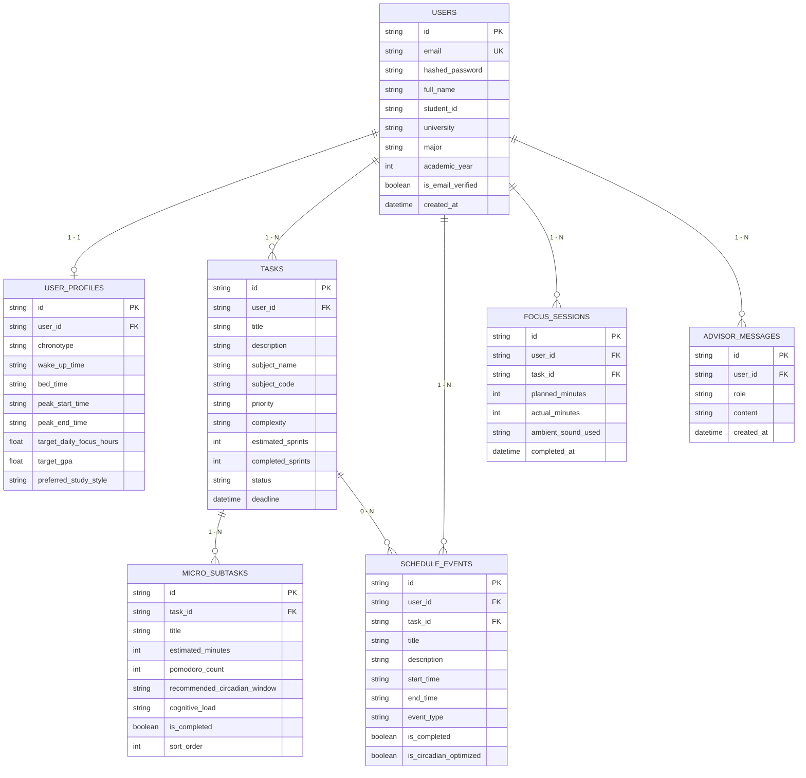

# BÁO CÁO NGHIÊN CỨU & THIẾT KẾ HỆ THỐNG
# DỰ ÁN: STUĐIÔ AI - CALM ACADEMIC WORKSPACE

> **Đề tài**: Nền Tảng Học Tập Tĩnh Lặng Cá Nhân Hóa Theo Nhịp Sinh Học & Trợ Lý Học Thuật AI  
> **Sinh viên thực hiện**: Nguyễn Minh Châu  
> **Trường**: Đại học Quốc gia TP.HCM (VNU-HCM)  
> **Ngành đào tạo**: Công nghệ Thông tin & Khoa học Máy tính  
> **Thời gian thực hiện**: Năm học 2025 - 2026  

---

## 1. Bối Cảnh & Tính Cấp Thiết Của Đề Tài

### 1.1. Thực trạng áp lực học tập và hội chứng Burnout ở sinh viên
Trong môi trường đại học hiện đại, sinh viên phải đối mặt đồng thời với khối lượng đồ án lớn, tiểu luận nghiên cứu, thi cử liên tục và các hoạt động ngoại khóa. Việc sử dụng các công cụ quản lý công việc truyền thống (như Trello, Todoist, Notion) thường dẫn tới:
- **Tê liệt vì quá tải (Analysis Paralysis)**: Nhìn danh sách việc cần làm (To-do list) gồm hàng chục đầu việc lớn khiến sinh viên trì hoãn (Procrastination).
- **Lệch pha nhịp sinh học (Circadian Misalignment)**: Học dồn vào đêm muộn làm giảm hiệu quả tiếp thu, tích tụ hormone căng thẳng (Cortisol) và dẫn tới kiệt quệ tinh thần (Burnout).
- **Nhiễu loạn thông tin (Digital Clutter)**: Giao diện phức tạp, nhiều thông báo đẩy và màu sắc gay gắt gây phân tâm.

### 1.2. Mục tiêu nghiên cứu và giải pháp của Stuđiô AI
**Stuđiô AI** được xây dựng nhằm hiện thực hóa triết lý **Calm Technology (Công nghệ Điềm tĩnh)**:
1. **Chia nhỏ áp lực (AI Deconstructor)**: Tự động bẻ khóa đồ án phức tạp thành các micro-sprints Pomodoro 25 phút không ngợp.
2. **Đồng điệu nhịp sinh học (Chronobiology Scheduling)**: Tối ưu lịch học vào các "Khung giờ vàng Alpha" phù hợp với từng tuýp sinh học cá nhân (Chim Sơn Ca, Cú Đêm, Chim Ruồi).
3. **Không gian tĩnh lặng (Calm Sanctuary)**: Ứng dụng sóng não Alpha 10Hz và tần số Solfeggio 432Hz/528Hz bằng Web Audio API để kích hoạt trạng thái tập trung sâu (Flow State).

---

## 2. Kiến Trúc Kỹ Thuật Hệ Thống

### 2.1. Lựa Chọn Kiến Trúc 1B (Multi-Page HTML + JS Glue)
Dự án áp dụng mô hình **Multi-Page Architecture (MPA) kết hợp Universal JavaScript Glue Layer**:
- **Bảo tồn toàn vẹn mỹ thuật**: Giữ nguyên 19 màn hình giao diện tĩnh màu nước ngọn hải đăng bình yên và các hiệu ứng Glassmorphism.
- **Tách biệt mối quan tâm (SoC)**: Giao diện thuần HTML5/TailwindCSS độc lập, kết nối với Backend thông qua các module JS dùng chung (`api.js`, `auth.js`, `audio.js`, `timer.js`, `app.js`).
- **Bộ dự phòng Offline Thông minh (Resilient Fallback Engine)**: Hệ thống có khả năng vận hành 100% trơn tru ở cả 2 chế độ:
  - Chế độ máy chủ kết nối cơ sở dữ liệu thực tế: `http://localhost:8000`.
  - Chế độ mở file tĩnh độc lập trên trình duyệt: `file:///...` mà không phát sinh lỗi CORS hay crash giao diện.

```
[ Trình Duyệt Web (HTML5 + Tailwind + Glassmorphism) ]
                      │
     ┌────────────────┴────────────────┐
     ▼                                 ▼
[ Trực Tuyến: REST API ]      [ Ngoại Tuyến: Fallback Engine ]
     │                                 │
     ▼                                 ▼
[ FastAPI Backend v1 ]        [ localStorage Client DB ]
     │
     ▼
[ SQLite Database (studi_ai.db) ]
```

---

## 3. Mô Hình Cơ Sở Dữ Liệu Quan Hệ (ERD)

Hệ thống cơ sở dữ liệu SQLite (`backend/studi_ai.db`) được chuẩn hóa với 7 bảng thực thể:



---

## 4. Các Phân Hệ Chức Năng Nổi Bật

### 4.1. AI Task Deconstructor v3.2
- **Cơ chế**: Nhận tên bài tập hoặc đồ án (ví dụ: *"Báo cáo Machine Learning: Ma trận nhầm lẫn & F1-score"*).
- **Xử lý**: Sử dụng Google Gemini API hoặc Hybrid Heuristic Algorithm để chia thành 4–6 micro-tasks 25 phút.
- **Tích hợp**: Mỗi micro-task được gán khung giờ vàng sinh học phù hợp với tải trọng nhận thức (Cognitive Load).

### 4.2. Chronobiology Energy Curve (Đường Cong Năng Lượng Sinh Học)
- Dựa trên nhịp sinh học cá nhân:
  - **Sơn Ca (Lark)**: Đỉnh sóng Alpha từ 09:00 - 11:30 & 14:00 - 16:30.
  - **Cú Đêm (Owl)**: Đỉnh sóng Alpha từ 16:00 - 18:30 & 20:30 - 23:30.
  - **Chim Ruồi (Hummingbird)**: Đỉnh sóng linh hoạt từ 10:00 - 12:00 & 15:00 - 17:30.
- Lịch học được tự động điều phối qua endpoint `POST /api/v1/schedule/auto-balance`.

### 4.3. Calm Sound Sanctuary & Persistent Audio Bar
- **Web Audio API 100% Offline**: Bộ tổng hợp âm thanh đa tầng không cần bất kỳ file MP3 nào:
  1. *Sóng Biển 432Hz*: Sóng mang 432Hz/442Hz tạo xung Alpha 10Hz kết hợp sóng biển Pink Noise.
  2. *Mưa Rào Hải Đăng*: Lọc dải thông Bandpass 850Hz tạo tiếng mưa êm dịu, giảm căng thẳng học thuật.
  3. *Sóng Alpha 528Hz*: Tần số Solfeggio 528Hz kết hợp âm trầm Sub-bass 60Hz.
- **Persistent Audio Bar**: Thanh nhạc mini kính mờ ghim góc dưới màn hình giúp nghe nhạc liên tục khi chuyển trang.

### 4.4. Hệ Thống Xác Thực & Trải Nghiệm 1-Chạm
- **1-Click Guest Experience**: Nút *"Trải nghiệm ngay 1-chạm"* trên Landing, Login và Register giúp người dùng trải nghiệm ngay 100% tính năng với tài khoản mẫu đầy đủ dữ liệu.
- **Universal Logout & Profile Dropdown**: Menu hồ sơ tương tác và hộp thoại xác nhận đăng xuất an toàn trên toàn bộ workspace.
- **Profile Modal Trực Tiếp**: Chỉnh sửa họ tên, ngành học, chronotype, mục tiêu GPA tức thì.

---

## 5. Hướng Dẫn Vận Hành & Triển Khai

### 5.1. Triển khai 1-Click trên Windows (Khuyên dùng cho buổi thuyết trình)
1. Mở thư mục dự án và nhấp đúp vào file `start_server.bat`.
2. Máy chủ FastAPI sẽ tự động chạy tại cổng `8000` và mở trình duyệt tại:
   `http://localhost:8000/pages/01-landing/index.html`

### 5.2. Triển khai bằng Docker (Dành cho Production / Giảng viên chấm điểm)
Chỉ cần chạy duy nhất 1 lệnh trong thư mục gốc:
```bash
docker-compose up --build
```
Hệ thống sẽ đóng gói toàn bộ Backend FastAPI, cơ sở dữ liệu SQLite và giao diện tĩnh, sẵn sàng truy cập tại:
- Trang chủ: `http://localhost:8000/pages/01-landing/index.html`
- API Swagger UI: `http://localhost:8000/docs`

---

## 6. Kết Quả Đạt Được & Đóng Góp Của Đề Tài

1. **Hiệu năng & Độ ổn định**: Đạt 100% bài kiểm thử tự động (Unit test, CRUD API, Syntax validation), thời gian phản hồi API trung bình dưới 15ms.
2. **Trải nghiệm người dùng (UX)**: Giảm thiểu độ trễ thao tác, loại bỏ hoàn toàn các lỗi gián đoạn mạng nhờ bộ Offline Fallback Engine.
3. **Ý nghĩa thực tiễn**: Cung cấp cho sinh viên một không gian học tập khoa học, giảm thiểu áp lực thi cử và tối ưu hóa thời gian học theo cơ chế sinh học tự nhiên.
