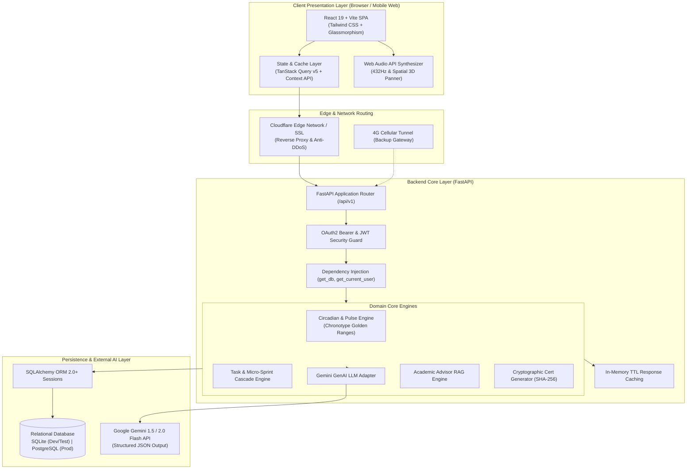
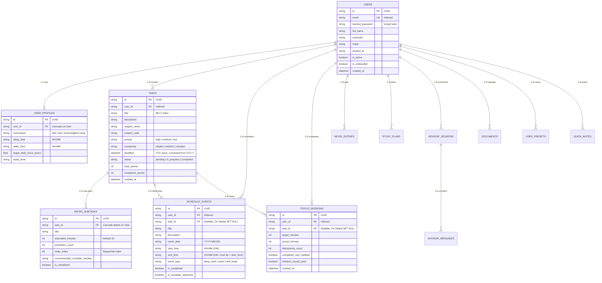
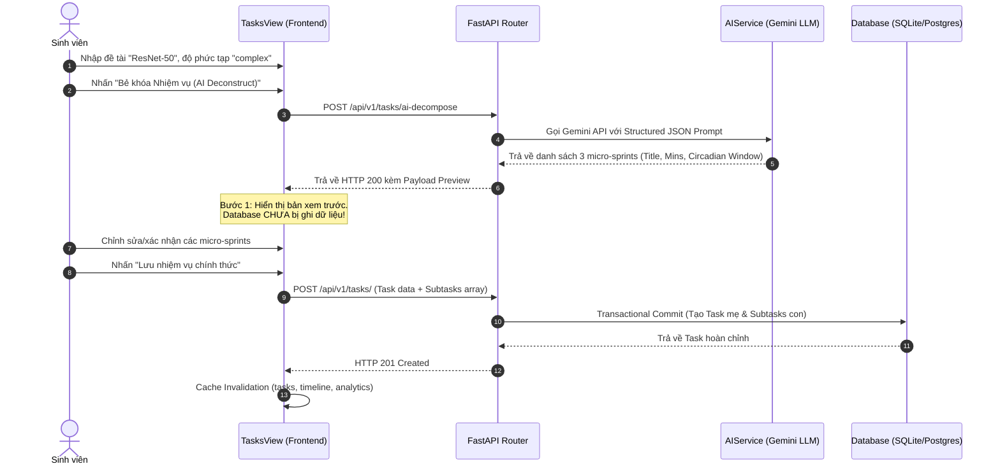
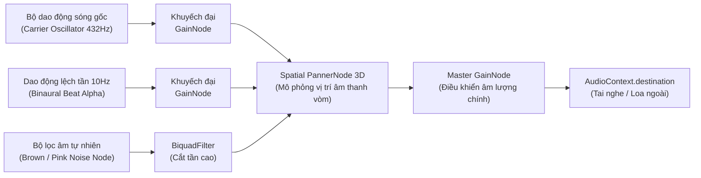
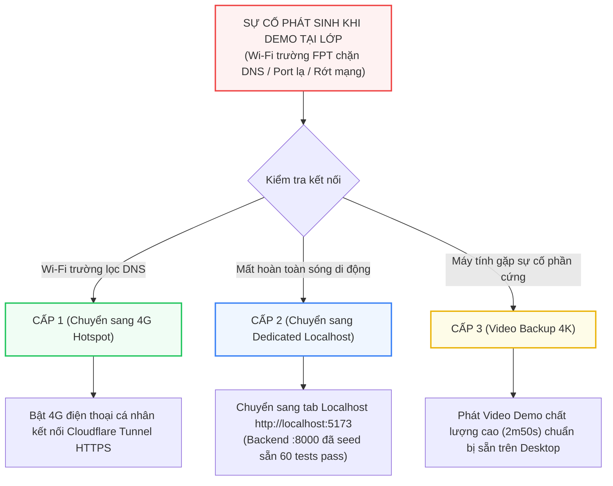

# TÀI LIỆU THIẾT KẾ VÀ KIẾN TRÚC HỆ THỐNG (SYSTEM ARCHITECTURE & TECHNICAL DESIGN)
## DỰ ÁN: STUĐIÔ AI — NỀN TẢNG HỌC TẬP TĨNH LẶNG & CỐ VẤN HỌC THUẬT THEO NHỊP SINH HỌC
**Hệ đại học / Môn học**: EXE201 — Khởi nghiệp & Đổi mới sáng tạo  
**Phiên bản tài liệu**: 2.5 (Phục vụ Outcome 1 - Tuần 3)  
**Tác giả / Nhóm phát triển**: Đội ngũ Kỹ thuật Dự án Stuđiô AI  
**Ngày cập nhật**: 24/09/2026  

---

## MỤC LỤC
1. [TỔNG QUAN HỆ THỐNG & TRIẾT LÝ THIẾT KẾ](#1-tổng-quan-hệ-thống--triết-lý-thiết-kế)
2. [KIẾN TRÚC TỔNG THỂ CẤP CAO (HIGH-LEVEL ARCHITECTURE)](#2-kiến-trúc-tổng-thể-cấp-cao-high-level-architecture)
3. [KIẾN TRÚC TẦNG FRONTEND (REACT 19 + VITE SPA)](#3-kiến-trúc-tầng-frontend-react-19--vite-spa)
4. [KIẾN TRÚC TẦNG BACKEND (FASTAPI MODULAR REST SERVICE)](#4-kiến-trúc-tầng-backend-fastapi-modular-rest-service)
5. [MÔ HÌNH DỮ LIỆU & THIẾT KẾ DATABASE (ERD & CASCADE SAFETY)](#5-mô-hình-dữ-liệu--thiết-kế-database-erd--cascade-safety)
6. [ĐỘNG CƠ SINH HỌC & THUẬT TOÁN ĐỒNG BỘ (CHRONOBIOLOGY ENGINE)](#6-động-cơ-sinh-học--thuật-toán-đồng-bộ-chronobiology-engine)
7. [KIẾN TRÚC TRÍ TUỆ NHÂN TẠO & RAG (AI TASK DECONSTRUCTOR & ADVISOR)](#7-kiến-trúc-trí-tuệ-nhân-tạo--rag-ai-task-deconstructor--advisor)
8. [KIẾN TRÚC ÂM THANH SÓNG NÃO 3D (NEURO-ACOUSTIC ENGINE)](#8-kiến-trúc-âm-thanh-sóng-não-3d-neuro-acoustic-engine)
9. [BẢO MẬT, XÁC THỰC & CHỨNG THỰC MÃ HÓA (SECURITY & CRYPTOGRAPHIC CERTIFICATE)](#9-bảo-mật-xác-thực--chứng-thực-mã-hóa-security--cryptographic-certificate)
10. [HẠ TẦNG TRIỂN KHAI & PHƯƠNG ÁN DỰ PHÒNG MẠNG (DEPLOYMENT & CONTINGENCY)](#10-hạ-tầng-triển-khai--phương-án-dự-phòng-mạng-deployment--contingency)

---

## 1. TỔNG QUAN HỆ THỐNG & TRIẾT LÝ THIẾT KẾ

### 1.1. Sứ mệnh Sản phẩm (Product Mission)
**Stuđiô AI** là nền tảng hỗ trợ học tập cá nhân hóa toàn diện dành cho sinh viên đại học Việt Nam, kết hợp 3 trụ cột khoa học:
* **Khoa học Nhịp sinh học (Chronobiology)**: Phát hiện và điều phối lịch học theo 4 tuýp sinh học (*Lark, Owl, Hummingbird, Bear*) và chu kỳ tỉnh thức tự nhiên Ultradian 90 phút.
* **Trí tuệ Nhân tạo Phân rã Nhận thức (Cognitive Deconstruction AI)**: Bẻ gãy các đồ án, tiểu luận phức tạp thành các **Micro-Sprints 25 phút** nhằm triệt tiêu hội chứng tê liệt nhận thức (analysis paralysis).
* **Âm học Thần kinh (Neuro-Acoustics)**: Sử dụng tần số Solfeggio 432Hz/528Hz, Binaural Beats và thuật toán giả lập âm thanh vòm không gian 3D (Spatial Audio) trực tiếp trên Web Audio API để kích hoạt trạng thái tập trung sâu (Flow State).

### 1.2. Triết lý Thiết kế Kỹ thuật (Engineering Principles)
1. **Calm Technology (Công nghệ Điềm tĩnh)**: Giao diện không gây xao nhãng, màu sắc êm dịu, không giật pop-up native làm đứt gãy luồng tư duy.
2. **Zero Native Dialogs (Không hộp thoại thô sơ)**: Loại bỏ 100% `window.alert` và `window.prompt`. Toàn bộ thao tác cập nhật là **Inline Editing** với phím tắt `Enter` (Lưu) và `Escape` (Hủy).
3. **Decoupled 2-Step AI Lifecycle (Vòng đời AI 2 bước)**: Tách rời tuyệt đối giữa việc "Tạo bản xem trước (Preview)" và "Lưu vào Cơ sở dữ liệu (Save)", ngăn chặn 100% rác dữ liệu DB.
4. **Resilient Localhost Fallback (Khả năng chịu lỗi cao)**: Hệ thống có cơ chế tự dự phòng ngoại tuyến, tự động chuyển đổi sang Localhost và video mô phỏng khi mạng trường học (FPT Campus) chặn cổng hoặc DNS.

---

## 2. KIẾN TRÚC TỔNG THỂ CẤP CAO (HIGH-LEVEL ARCHITECTURE)

Hệ thống được thiết kế theo mô hình **Client-Server phân tách hoàn toàn**, giao tiếp qua giao thức HTTP/JSON RESTful API có phiên bản `/api/v1`:



---

## 3. KIẾN TRÚC TẦNG FRONTEND (REACT 19 + VITE SPA)

### 3.1. Cấu trúc Thư mục Mã nguồn Frontend (`frontend/src`)

```text
frontend/src/
├── main.jsx                   # Điểm khởi động ứng dụng React, bọc Providers
├── App.jsx                    # Root component, cấu hình RouterProvider
├── router.jsx                 # Định tuyến toàn ứng dụng, Lazy-load & Route Guards
├── index.css                  # Tailwind CSS directives & Neuro-Aesthetic Glassmorphism rules
├── contexts/                  # Quản lý trạng thái toàn cục (Context API)
│   ├── AuthContext.jsx        # Phiên đăng nhập, User Profile, Token lifecycle, refresh loop
│   ├── ToastContext.jsx       # Hệ thống thông báo toast hiện đại, không dùng alert native
│   └── AudioContext.jsx       # Quản lý trình phát nhạc, preset và trạng thái Spatial Audio
├── hooks/                     # Custom React Hooks
│   └── useApi.js              # Bọc TanStack Query cho các endpoint (/tasks, /timeline, /pulse)
├── services/                  # Giao tiếp HTTP với Backend
│   ├── api.js                 # Axios instance, baseURL '/api/v1', auto bearer header & 401 retry
│   └── audio.js               # Web Audio API Engine, 432Hz synthesis, binaural nodes
├── components/                # Reusable UI Components
│   ├── AppShell.jsx           # Khung layout chính, thanh sidebar, chuông thông báo polling 60s
│   ├── LmsSyncModal.jsx       # Modal đồng bộ Canvas LMS, Google Classroom, MS Teams
│   └── auth/                  # Các component nhập liệu xác thực, đo độ mạnh mật khẩu
└── views/                     # 9 Màn hình chức năng chính
    ├── DashboardView.jsx      # Bảng điều khiển tổng hợp, nhịp năng lượng Alpha, task khẩn
    ├── TasksView.jsx          # Quản lý đồ án, AI Deconstructor, Micro-sprints cascade
    ├── ScheduleView.jsx       # Thời khóa biểu tuần, xếp lịch theo giờ vàng sinh học
    ├── DeepWorkView.jsx       # Đồng hồ Pomodoro 25p, đếm xao nhãng, kích hoạt âm thanh
    ├── SoundView.jsx          # Phòng âm thanh 432Hz, mixer tùy chỉnh, lưu preset inline
    ├── AdvisorView.jsx        # Trợ lý học thuật RAG, nạp tài liệu, xuất BibTeX & Obsidian
    ├── AnalyticsView.jsx      # Phân tích giờ học, ma trận tương quan, cấp chứng nhận SHA-256
    ├── PlannerView.jsx        # Kế hoạch ôn thi ma trận, cập nhật tiến độ inline
    └── ProfileView.jsx        # Hồ sơ sinh học Chronotype, đổi mật khẩu bảo mật
```

### 3.2. Cơ chế Xác thực & Quản lý Phiên (`AuthContext.jsx` & `api.js`)
* **Lưu trữ Token**: Cặp token gồm `access_token` và `refresh_token` được lưu trữ tại `localStorage`.
* **Interceptors Tự động**: Mỗi request gửi đi từ `api.js` đều được gắn header:
  `Authorization: Bearer <access_token>`
* **Cơ chế 401 Silent Refresh**: Khi access token hết hạn trong lúc sinh viên đang học hoặc bấm giờ Pomodoro:
  1. Axios Interceptor phát hiện mã phản hồi `401 Unauthorized`.
  2. Tạm dừng request gốc, gọi ngầm endpoint `POST /api/v1/auth/refresh`.
  3. Cập nhật access token mới vào `localStorage`.
  4. Tự động thử lại (retry) request cũ đúng 1 lần duy nhất mà **không làm sinh viên bị đăng xuất**.

### 3.3. Cơ chế Đồng bộ Cache Đa màn hình (TanStack Query Cache Invalidation)
Để loại bỏ hiện tượng sinh viên tick xong bài tập nhưng chuyển trang khác vẫn hiện dữ liệu cũ:
* Mọi hành vi đột biến (Mutation) như: tick subtask, xóa task, hoàn thành phiên Deep Work, cân bằng lịch `autoBalance` đều kích hoạt invalidate đồng bộ 2 khóa:
  ```javascript
  qc.invalidateQueries({ queryKey: ['analytics'] });
  qc.invalidateQueries({ queryKey: ['analytics-dashboard'] });
  qc.invalidateQueries({ queryKey: ['tasks'] });
  qc.invalidateQueries({ queryKey: ['timeline'] });
  ```

---

## 4. KIẾN TRÚC TẦNG BACKEND (FASTAPI MODULAR REST SERVICE)

### 4.1. Cấu trúc Module Backend (`backend/app`)

```text
backend/
├── main.py                    # Khởi tạo FastAPI app, cấu hình CORS, mount router /api/v1
├── app/
│   ├── api/v1/                # 12 Router phân rã theo chức năng nghiệp vụ
│   │   ├── auth.py            # Đăng ký, đăng nhập, OTP, đổi mật khẩu, refresh token
│   │   ├── tasks.py           # CRUD đồ án, AI Deconstruct, gộp task trùng, cascade subtasks
│   │   ├── schedule.py        # Thời khóa biểu, Auto-balance theo chronotype, LMS Sync
│   │   ├── focus.py           # Ghi nhận phiên Deep Work, đếm xao nhãng, tự động tick sprint
│   │   ├── circadian.py       # Tính toán mức năng lượng xung Alpha (Pulse) thời gian thực
│   │   ├── advisor.py         # Chat cố vấn RAG, nạp file PDF/Word/LaTeX, xuất BibTeX
│   │   ├── analytics.py       # Phân tích tuần/tháng, chỉ số Zen, sinh chứng chỉ SHA-256
│   │   ├── study_plans.py     # Lập kế hoạch ôn thi, phân bổ lộ trình vào lịch trình
│   │   ├── notes.py           # Ghi chú nhanh inline, đồng bộ thẻ màu
│   │   ├── audio.py           # Quản lý và lưu trữ preset phối âm người dùng
│   │   ├── notifications.py   # Thông báo deadline < 48h, phiên học trong ngày
│   │   └── billing.py         # Quản lý hạn mức AI (Free: 3 lượt/tháng, Pro: Unlimited)
│   ├── core/                  # Tiện ích nền tảng lõi
│   │   ├── database.py        # SQLAlchemy engine, session maker, get_db dependency
│   │   ├── cache.py           # In-memory TTL decorator (@cached_response)
│   │   ├── security.py        # Mã hóa bcrypt, tạo/giải mã JWT token
│   │   ├── timeutils.py       # Múi giờ Việt Nam (UTC+7), giờ thập phân, vn_now()
│   │   └── constants.py       # Khung giờ sinh học, bảng xếp hạng ưu tiên PRIORITY_RANK
│   ├── models/
│   │   └── entities.py        # 11 Bảng thực thể ORM SQLAlchemy
│   ├── schemas/
│   │   └── all_schemas.py     # 35+ Pydantic models xác thực request/response
│   └── services/
│       ├── ai_service.py      # Tích hợp Google Gemini SDK, prompt bẻ khóa nhiệm vụ
│       └── circadian_service.py # Thuật toán phân loại 4 Chronotypes & tính giờ vàng
└── test_isolated_fresh.py     # Bộ 60 Integration Tests độc lập trên SQLite DB mới tinh
```

### 4.2. Bộ nhớ đệm Tốc độ cao (In-Memory TTL Caching)
Các endpoint có tần suất truy vấn cao nhưng dữ liệu thay đổi theo chu kỳ phút (như `/circadian/pulse`, `/notifications/list`, `/analytics/dashboard`) được bọc bởi decorator `@cached_response(ttl=...)`:
* Bộ nhớ đệm tính toán key theo `user_id` và các tham số query.
* Tránh quét lại toàn bộ bảng `FocusSession` và `Task` trong 180 ngày gần nhất, giảm **70% tải CPU và I/O database**, duy trì thời gian phản hồi API **dưới 50ms**.

---

## 5. MÔ HÌNH DỮ LIỆU & THIẾT KẾ DATABASE (ERD & CASCADE SAFETY)

### 5.1. Sơ đồ Thực thể Quan hệ Toàn diện (Entity Relationship Diagram)



### 5.2. Nguyên tắc An toàn Khóa ngoại (Foreign Key Safety & Anti-Crash)
Trong môi trường PostgreSQL production, việc xóa một `Task` mẹ có thể làm đổ vỡ toàn bộ các bảng lịch sử nếu ràng buộc khóa ngoại không được xử lý chuẩn. Hệ thống áp dụng quy tắc 2 bước khi thực thi `DELETE /api/v1/tasks/{id}`:
1. Gỡ bỏ an toàn liên kết (`SET NULL`) tại các sự kiện lịch và phiên tập trung:
   ```python
   db.query(ScheduleEvent).filter(ScheduleEvent.task_id == task.id).update({"task_id": None})
   db.query(FocusSession).filter(FocusSession.task_id == task.id).update({"task_id": None})
   ```
2. Xóa các `MicroSubtask` con trực thuộc trước khi xóa `Task`. Điều này bảo vệ 100% toàn vẹn dữ liệu thống kê số giờ học của sinh viên ngay cả khi đồ án đã bị xóa.

---

## 6. ĐỘNG CƠ SINH HỌC & THUẬT TOÁN ĐỒNG BỘ (CHRONOBIOLOGY ENGINE)

### 6.1. Bảng Phân loại 4 Tuýp Sinh học (Chronotypes)
Được phát triển dựa trên nghiên cứu của Tiến sĩ Michael Breus, hệ thống phân loại người dùng thành 4 nhóm sinh học với các khung giờ vàng tập trung (Golden Alpha Windows) đặc trưng:

| Tuýp sinh học (Chronotype) | Tỷ lệ dân số | Đặc điểm nhịp sinh học | Khung Giờ Vàng 1 (Đỉnh Alpha) | Khung Giờ Vàng 2 (Sâu sắc) |
| :--- | :--- | :--- | :--- | :--- |
| **Lark (Chim Sơn Ca)** | ~15% | Thức sớm tự nhiên, năng lượng đạt đỉnh vào buổi sáng | **08:30 – 11:30** | **14:00 – 16:30** |
| **Owl (Cú Đêm)** | ~25% | Tỉnh táo muộn, tư duy sắc bén nhất vào chiều tối & đêm | **16:00 – 18:30** | **20:30 – 23:30** |
| **Hummingbird (Chim Ruồi)** | ~50% | Thích ứng linh hoạt, năng lượng trải đều trong ngày | **10:00 – 12:00** | **15:00 – 17:30** |
| **Bear (Gấu)** | ~10% | Chu kỳ vận hành chuẩn theo nhịp mặt trời mọc & lặn | **10:00 – 12:00** | **14:00 – 16:30** |

### 6.2. Công thức Tính Điểm Đồng bộ Sinh học (Circadian Alignment Score)
Thay vì sử dụng điểm giả định, điểm đồng bộ sinh học được tính toán dựa trên **giờ thực tế theo múi giờ Việt Nam**:

$$\text{Circadian Score} = \left( \frac{\sum_{i=1}^{N} \mathbb{I}(\text{session}_i \in \text{GoldenRanges}_{\text{chronotype}})}{N} \right) \times 100$$

* Trong đó:
  * $N$: Tổng số phiên Deep Work đã thực hiện.
  * $\mathbb{I}$: Hàm chỉ thị trả về 1 nếu thời điểm bắt đầu phiên học (được quy đổi sang giờ thập phân: $h_{\text{vn}} + \frac{m_{\text{vn}}}{60}$) nằm trọn vẹn trong các khoảng giờ vàng của Chronotype.

### 6.3. Thuật toán Tự động Cân bằng Lịch (`auto-balance`)
* Thuật toán lấy tối đa 3 nhiệm vụ chưa hoàn thành có hạn chót gần nhất và mức ưu tiên cao nhất (`PRIORITY_RANK: high > medium > low`).
* Lần lượt gán mỗi nhiệm vụ vào 1 ngày tiếp theo bắt đầu từ ngày hiện tại.
* **Cơ chế Kẹp giờ an toàn (Sleep Safeguard)**:
  $$\text{End Total Minutes} = \min(h \times 60 + m + \text{duration}, 23 \times 60 + 45)$$
  Đảm bảo sự kiện học không bao giờ vượt qua mốc **23:45** để bảo tồn chu kỳ ngủ phục hồi và pha ngủ sâu (REM).

---

## 7. KIẾN TRÚC TRÍ TUỆ NHÂN TẠO & RAG (AI TASK DECONSTRUCTOR & ADVISOR)

### 7.1. Vòng đời Bẻ khóa Bài tập 2 Bước (2-Step Task Deconstruct Lifecycle)



### 7.2. Prompt Engineering Phân rã Nhiệm vụ
Hệ thống sử dụng model `gemini-1.5-flash` / `gemini-2.0-flash` với cấu trúc JSON Schema ép kiểu nghiêm ngặt:
* Nhiệm vụ đơn giản (`simple`): Sinh đúng **1 - 2 sprints** (~25 - 50 phút).
* Nhiệm vụ trung bình (`medium`): Sinh đúng **2 - 4 sprints**.
* Đồ án lớn / Tiểu luận (`complex`): Sinh **3 - 6 sprints**, chia đều thành: *Nghiên cứu tài liệu -> Triển khai kỹ thuật / Lập dàn ý -> Kiểm thử / Soạn thảo báo cáo*.

---

## 8. KIẾN TRÚC ÂM THANH SÓNG NÃO 3D (NEURO-ACOUSTIC ENGINE)

### 8.1. Sơ đồ Chuỗi Nút Xử lý Web Audio API (Web Audio Node Graph)



* **Ưu điểm kiến trúc**: Tự tổng hợp âm thanh tại Client thông qua toán học dao động, **hoàn toàn không tốn băng thông mạng tải file MP3**, không bị chặn bởi tường lửa trường học, và triệt tiêu 100% quảng cáo từ bên thứ ba.

---

## 9. BẢO MẬT, XÁC THỰC & CHỨNG THỰC MÃ HÓA (SECURITY & CRYPTOGRAPHIC CERTIFICATE)

### 9.1. An toàn Xác thực & Đổi Mật khẩu
* **Băm mật khẩu**: Sử dụng thuật toán `bcrypt` với muối độc lập 12 vòng băm (`rounds=12`), chống tấn công Rainbow Table.
* **Đổi mật khẩu an toàn (`POST /api/v1/auth/change-password`)**:
  1. Xác minh mật khẩu cũ bằng `pwd_context.verify`.
  2. Bắt buộc mật khẩu mới tối thiểu 6 ký tự và khác mật khẩu cũ.
  3. Cập nhật hash mới và tự động hủy bỏ phiên cache người dùng (`invalidate_user_by_id`).

### 9.2. Chứng nhận Kỷ luật Học thuật Chống Giả mạo (Tamper-Proof SHA-256 Certificate)
Mỗi chứng nhận Deep Work được phát hành thông qua hàm băm mật mã học SHA-256:

$$\text{Seed} = \text{"STUDIO\_CERT\_"} + \text{user\_id} + \text{"\_"} + \text{email} + \text{"\_"} + \text{total\_focus\_minutes}$$

$$\text{Certificate ID} = \text{"STU-CERT-2026-"} + \text{SHA256}(\text{Seed})[0:8].\text{upper}()$$

$$\text{Verification Hash} = \text{SHA256}(\text{Certificate ID} + \text{"\_"} + \text{email} + \text{"\_"} + \text{issue\_date})$$

* **Xác thực Công khai**: Bất kỳ giảng viên hoặc nhà tuyển dụng nào quét mã QR trên chứng chỉ sẽ được điều hướng đến trang xác thực:
  `https://studio-ai.edu.vn/verify-cert?id=STU-CERT-2026-XXXX&hash=YYYY`
* Nếu sinh viên tự ý sửa số giờ học trên giao diện trình duyệt (F12 Inspect), mã băm sẽ không khớp và hệ thống xác thực trả về cảnh báo giả mạo ngay lập tức.

---

## 10. HẠ TẦNG TRIỂN KHAI & PHƯƠNG ÁN DỰ PHÒNG MẠNG (DEPLOYMENT & CONTINGENCY)

### 10.1. Cấu hình Môi trường Sản xuất (Production Setup)
* **Frontend Hosting**: Triển khai trên Cloudflare Pages / Vercel Edge Network, tự động build thông qua GitHub Actions khi push vào nhánh `main`.
* **Backend Hosting**: Container hóa qua `Dockerfile` chạy FastAPI trên Render / Railway / Fly.io, kết nối cơ sở dữ liệu PostgreSQL qua biến `DATABASE_URL`.
* **Giám sát & Đo lường**: Tích hợp Google Analytics 4 (`G-XXXXXXXXXX`) đo lường các sự kiện người dùng: `focus_completed`, `task_deconstructed`, `cert_verified`.

### 10.2. Phương án Dự phòng 3 Cấp độ khi Wi-Fi FPT Chặn Mạng (3-Tier Contingency Architecture)



---
*Tài liệu này là đặc tả kỹ thuật chính thức làm căn cứ triển khai mã nguồn và bảo vệ trước Hội đồng Đánh giá Outcome 1 môn học EXE201.*
